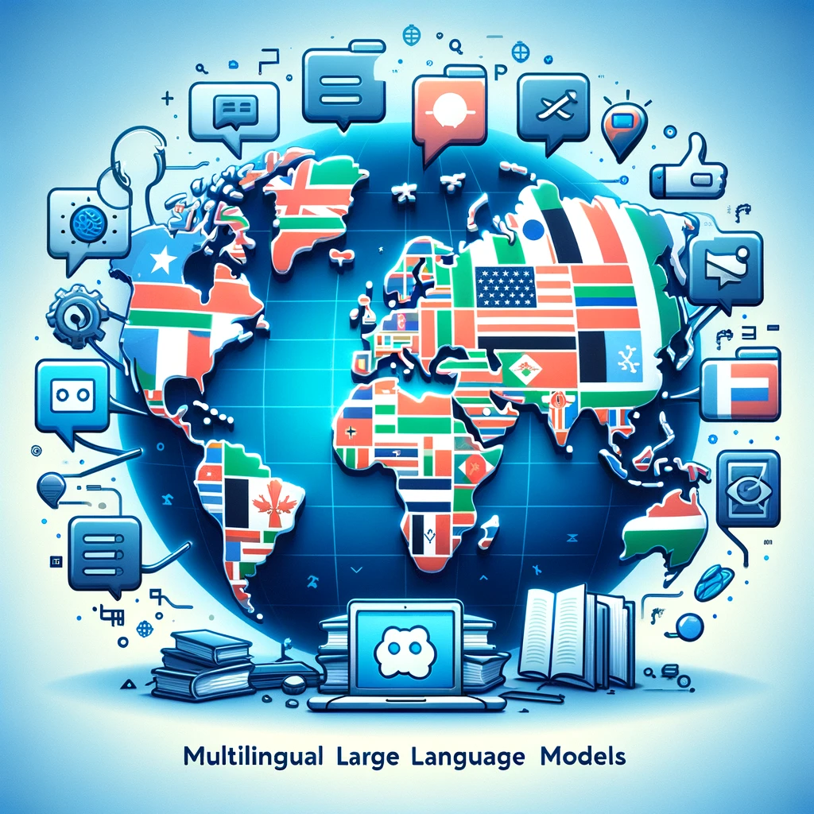

  
  <h1>Awesome Multilingual Large Language Models</h1>
  
  

    A comprehensive collection of multilingual datasets and large language models, meticulously curated for evaluating and enhancing the performance of large language models across diverse languages and tasks.
  

  
  
<!-- Badges -->

  
  
  
  
  
  

   

 

## Datasets
|  Dataset  |   Year  |   Languages   |   GitHub   |   Download   |
|:--------|:--------:|:--------:|:--------:|:--------:|
|    [**OMGEval : An Open Multilingual Generative Evaluation Benchmark for Large Language Models**](https://arxiv.org/pdf/2402.13524)   | 2024 | Chinese (zh) (🇨🇳), Russian (ru) (🇷🇺), French (fr) (🇫🇷), Spanish (es) (🇪🇸), Arabic (ar) (🇸🇦) | [Github](https://github.com/blcuicall/OMGEval) | [Data](https://github.com/blcuicall/OMGEval) |
|    [**MoZIP: A Multilingual Benchmark to Evaluate Large Language Models in Intellectual Property**](https://arxiv.org/pdf/2402.16389)   | 2024 | Chinese (zh) (🇨🇳), English (en) (🇬🇧), German (de) (🇩🇪), Japanese (ja) (🇯🇵), French (fr) (🇫🇷), Korean (ko) (🇰🇷), Russian (ru) (🇷🇺), Spanish (es) (🇪🇸), Portuguese (pt) (🇵🇹), Catalan (ca) (🇦🇩) | [Github](https://github.com/AI-for-Science/MoZi) | [Data](https://huggingface.co/datasets/BNNT/IPQuiz) |
|    [**MLaKE: Multilingual Knowledge Editing Benchmark for Large Language Models**](https://arxiv.org/pdf/2404.04990)   | 2024 | English (en) (🇬🇧), Chinese (zh) (🇨🇳), Japanese (ja) (🇯🇵), French (fr) (🇫🇷), German (de) (🇩🇪) | [Github](https://github.com/Hi-archers/MLaKE/) | [Data](https://github.com/Hi-archers/MLaKE/) |
|    [**M3Exam: A Multilingual, Multimodal, Multilevel Benchmark for Examining Large Language Models**](https://proceedings.neurips.cc/paper_files/paper/2023/file/117c5c8622b0d539f74f6d1fb082a2e9-Paper-Datasets_and_Benchmarks.pdf)   | 2023 | English (🇺🇸), Chinese (🇨🇳), Italian (🇮🇹), Portuguese (🇧🇷), Vietnamese (🇻🇳), Thai (🇹🇭), Swahili (🇰🇪), Afrikaans (🇿🇦), Javanese (🇮🇩) | [Github](https://github.com/DAMO-NLP-SG/M3Exam) | [Data](https://github.com/DAMO-NLP-SG/M3Exam) |
|    [**Language models are multilingual chain-of-thought reasoners**](https://arxiv.org/pdf/2210.03057)   | 2023 | Bengali (🇧🇩), Chinese (🇨🇳), French (🇫🇷), German (🇩🇪), Japanese (🇯🇵), Russian (🇷🇺), Spanish (🇪🇸), Swahili (🇰🇪), Telugu (🇮🇳), Thai (🇹🇭) | [Github](https://github.com/google-research/url-nlp) | [Data](https://github.com/google-research/url-nlp) |
| [**CulturaX: A Cleaned, Enormous, and Multilingual Dataset for Large Language Models in 167 Languages**](https://arxiv.org/pdf/2309.09400)   | 2023 | English [🇬🇧], Russian [🇷🇺], Spanish [🇪🇸], German [🇩🇪], French [🇫🇷], Chinese [🇨🇳], Italian [🇮🇹], Portuguese [🇵🇹], Polish [🇵🇱], Japanese [🇯🇵], Vietnamese [🇻🇳], Dutch [🇳🇱], Arabic [🇸🇦], Turkish [🇹🇷], Czech [🇨🇿], Persian [🇮🇷], Hungarian [🇭🇺], Greek [🇬🇷], Romanian [🇷🇴], Swedish [🇸🇪], Ukrainian [🇺🇦], Finnish [🇫🇮], Korean [🇰🇷], Danish [🇩🇰], Bulgarian [🇧🇬], Norwegian [🇳🇴], Hindi [🇮🇳], Slovak [🇸🇰], Thai [🇹🇭], Lithuanian [🇱🇹], Catalan [🇪🇸], Indonesian [🇮🇩], Bangla [🇧🇩], Estonian [🇪🇪], Slovenian [🇸🇮], Latvian [🇱🇻], Hebrew [🇮🇱], Serbian [🇷🇸], Tamil [🇮🇳], Albanian [🇦🇱], Azerbaijani [🇦🇿] | [🤗](https://huggingface.co/datasets/uonlp/CulturaX) | [Data](https://huggingface.co/datasets/uonlp/CulturaX) |
|    [**Language models are multilingual chain-of-thought reasoners**](https://arxiv.org/pdf/2210.03057)   | 2023 | Bengali (🇧🇩), Chinese (🇨🇳), French (🇫🇷), German (🇩🇪), Japanese (🇯🇵), Russian (🇷🇺), Spanish (🇪🇸), Swahili (🇰🇪), Telugu (🇮🇳), Thai (🇹🇭) | [Github](https://github.com/google-research/url-nlp) | [Data](https://github.com/google-research/url-nlp) |
| [**Wiki-40B: Multilingual Language Model Dataset**](https://aclanthology.org/2020.lrec-1.297.pdf) | 2020 | English (🇺🇸), German (🇩🇪), French (🇫🇷), Russian (🇷🇺), Spanish (🇪🇸), Italian (🇮🇹), Japanese (🇯🇵), Chinese Simplified (🇨🇳), Chinese Traditional (🇹🇼), Polish (🇵🇱), Ukrainian (🇺🇦), Dutch (🇳🇱), Swedish (🇸🇪), Portuguese (🇵🇹), Serbian (🇷🇸), Hungarian (🇭🇺), Catalan (🇪🇸), Czech (🇨🇿), Finnish (🇫🇮), Arabic (🇸🇦), Korean (🇰🇷), Persian (🇮🇷), Norwegian (🇳🇴), Vietnamese (🇻🇳), Hebrew (🇮🇱), Indonesian (🇮🇩), Romanian (🇷🇴), Turkish (🇹🇷), Bulgarian (🇧🇬), Estonian (🇪🇪), Malay (🇲🇾), Danish (🇩🇰), Slovak (🇸🇰), Croatian (🇭🇷), Greek (🇬🇷), Lithuanian (🇱🇹), Slovenian (🇸🇮), Thai (🇹🇭), Hindi (🇮🇳), Latvian (🇱🇻), Filipino (🇵🇭) | 👁️ | [Data](https://aclanthology.org/2020.lrec-1.297.pdf) |
| [**Common Sense Beyond English: Evaluating and Improving Multilingual Language Models for Commonsense Reasoning**](https://arxiv.org/pdf/2106.06937) | 2021 | English (🇺🇸), German (🇩🇪), French (🇫🇷), Russian (🇷🇺), Spanish (🇪🇸), Hindi (🇮🇳), Vietnamese (🇻🇳), Bulgarian (🇧🇬), Chinese (🇨🇳), Dutch (🇳🇱), Italian (🇮🇹), Japanese (🇯🇵), Polish (🇵🇱), Portuguese (🇵🇹), Arabic (🇸🇦), Swahili (🇹🇿), Urdu (🇵🇰) | [GitHub](https://github.com/INK-USC/XCSR/)️ | [Data](https://inklab.usc.edu/XCSR/) |
| [**The BigScience ROOTS Corpus: A 1.6TB Composite Multilingual Dataset**](https://proceedings.neurips.cc/paper_files/paper/2022/file/ce9e92e3de2372a4b93353eb7f3dc0bd-Paper-Datasets_and_Benchmarks.pdf) | 2022 |  Akan (🇬🇭), Arabic (🇸🇦), Assamese (🇮🇳), Bambara (🇲🇱), Basque (🇪🇸), Bengali (🇧🇩), Catalan (🇪🇸), Chichewa (🇲🇼), chiShona (🇿🇼), Chitumbuka (🇲🇼), English (🇬🇧), Fon (🇧🇯), French (🇫🇷), Gujarati (🇮🇳), Hindi (🇮🇳), Igbo (🇳🇬), Indonesian (🇮🇩), isiXhosa (🇿🇦), isiZulu (🇿🇦), Kannada (🇮🇳), Kikuyu (🇰🇪), Kinyarwanda (🇷🇼), Kirundi (🇧🇮), Lingala (🇨🇩), Luganda (🇺🇬), Malayalam (🇮🇳), Marathi (🇮🇳), Nepali (🇳🇵), Northern Sotho (🇿🇦), Odia (🇮🇳), Portuguese (🇵🇹), Punjabi (🇮🇳), Sesotho (🇱🇸), Setswana (🇧🇼), Simplified Chinese (🇨🇳), Spanish (🇪🇸), Swahili (🇰🇪), Tamil (🇮🇳), Telugu (🇮🇳), Traditional Chinese (🇹🇼), Twi (🇬🇭), Urdu (🇵🇰), Vietnamese (🇻🇳), Wolof (🇸🇳), Xitsonga (🇿🇦), Yoruba (🇳🇬), Programming Languages (💻) | [GitHub](https://github.com/bigscience-workshop/data-preparation)️ | [Data](https://huggingface.co/bigscience-data) |
| [**GEOMLAMA: Geo-Diverse Commonsense Probing on Multilingual Pre-Trained Language Models**](https://arxiv.org/pdf/2205.12247) | 2022 | English (🇺🇸), Chinese (🇨🇳), Hindi (🇮🇳), Persian (🇮🇷), Swahili (🇰🇪) | [GitHub](https://github.com/WadeYin9712/GeoMLAMA)️ | 🔍 |  

## Models
|  Title  |   Year  |   Languages   |   Code   |   Demo   |
|:--------|:--------:|:--------:|:--------:|:--------:|
| [**Aya Model: An Instruction Finetuned Open-Access Multilingual Language Model**](https://arxiv.org/pdf/2402.07827)   | 2024 | Afrikaans [🇿🇦], Amharic [🇪🇹], Arabic [🇸🇦], Azerbaijani [🇦🇿], Belarusian [🇧🇾], Bengali [🇧🇩], Bulgarian [🇧🇬], Catalan [🇪🇸], Cebuano [🇵🇭], Czech [🇨🇿], Welsh [🏴], Danish [🇩🇰], German [🇩🇪], Greek [🇬🇷], English [🇬🇧], Esperanto [🇪🇸], Estonian [🇪🇪], Basque [🇪🇸], Finnish [🇫🇮], Tagalog [🇵🇭], French [🇫🇷], Western Frisian [🇳🇱], Scottish Gaelic [🏴], Irish [🇮🇪], Galician [🇪🇸], Gujarati [🇮🇳], Haitian Creole [🇭🇹], Hausa [🇳🇪], Hebrew [🇮🇱], Hindi [🇮🇳], Hungarian [🇭🇺], Armenian [🇦🇲], Igbo [🇳🇬], Indonesian [🇮🇩], Icelandic [🇮🇸], Italian [🇮🇹], Javanese [🇮🇩], Japanese [🇯🇵], Kannada [🇮🇳], Georgian [🇬🇪], Kazakh [🇰🇿], Khmer [🇰🇭], Kyrgyz [🇰🇬], Korean [🇰🇷], Kurdish [🇹🇷], Lao [🇱🇦], Latvian [🇱🇻], Latin [🇻🇦], Lithuanian [🇱🇹], Luxembourgish [🇱🇺], Malayalam [🇮🇳], Marathi [🇮🇳], Macedonian [🇲🇰], Malagasy [🇲🇬], Maltese [🇲🇹], Mongolian [🇲🇳], Maori [🇳🇿], Malay [🇲🇾], Burmese [🇲🇲], Nepali [🇳🇵], Dutch [🇳🇱], Norwegian [🇳🇴], Northern Sotho [🇿🇦], Chichewa [🇲🇼], Oriya [🇮🇳], Punjabi [🇮🇳], Persian [🇮🇷], Polish [🇵🇱], Portuguese [🇵🇹], Pashto [🇦🇫], Romanian [🇷🇴], Russian [🇷🇺], Sinhala [🇱🇰], Slovak [🇸🇰], Slovenian [🇸🇮], Samoan [🇼🇸], Shona [🇿🇼], Sindhi [🇵🇰], Somali [🇸🇴], Southern Sotho [🇱🇸], Spanish [🇪🇸], Albanian [🇦🇱], Serbian [🇷🇸], Sundanese [🇮🇩], Swahili [🇰🇪], Swedish [🇸🇪], Tamil [🇮🇳], Telugu [🇮🇳], Tajik [🇹🇯], Thai [🇹🇭], Turkish [🇹🇷], Twi [🇬🇭], Ukrainian [🇺🇦], Urdu [🇵🇰], Uzbek [🇺🇿], Vietnamese [🇻🇳], Xhosa [🇿🇦], Yiddish [🇮🇱], Yoruba [🇳🇬], Chinese [🇨🇳], Zulu [🇿🇦] | [Source](https://huggingface.co/CohereForAI/aya-101) | [🤗](https://huggingface.co/CohereForAI/aya-101) |
|    [**LANGBRIDGE: Multilingual Reasoning Without Multilingual Supervision**](https://arxiv.org/pdf/2309.10305)   | 2024 | Arabic (ar) (🇸🇦), Bengali (bn) (🇧🇩), Chinese (zh) (🇨🇳), Danish (da) (🇩🇰), Dutch (nl) (🇳🇱), English (en) (🇬🇧), French (fr) (🇫🇷), German (de) (🇩🇪), Hindi (hi) (🇮🇳), Japanese (ja) (🇯🇵), Korean (ko) (🇰🇷), Marathi (mr) (🇮🇳), Punjabi (pa) (🇮🇳), Russian (ru) (🇷🇺), Spanish (es) (🇪🇸), Swahili (sw) (🇰🇪), Telugu (te) (🇮🇳), Turkish (tr) (🇹🇷), Urdu (ur) (🇵🇰) | [Github](https://github.com/kaistAI/LangBridge) | [🤗](https://github.com/kaistAI/LangBridge) |
|    [**Orion-14B: Open-source Multilingual Large Language Models**](https://arxiv.org/pdf/2401.12246)   | 2024 | English [🇬🇧], Chinese [🇨🇳], Japanese [🇯🇵], Korean [🇰🇷], Spanish [🇪🇸], French [🇫🇷], German [🇩🇪], Arabic [🇸🇦] | [Github](https://github.com/OrionStarAI/Orion) | [🤗](https://huggingface.co/OrionStarAI) |
|    [**Baichuan 2: Open Large-scale Language Models**](https://arxiv.org/pdf/2309.10305)   | 2023 | Arabic (ar) (🇸🇦), Chinese (zh) (🇨🇳), English (en) (🇬🇧), French (fr) (🇫🇷), Russian (ru) (🇷🇺), Spanish (es) (🇪🇸), German (de) (🇩🇪), Japanese (ja) (🇯🇵) | [Github](https://github.com/baichuan-inc/Baichuan2) | [🤗](huggingface.co/baichuan-inc) |
|    [**Larger-Scale Transformers for Multilingual Masked Language Modeling**](https://arxiv.org/pdf/2405.05949)   | 2021 | Afrikaans (🇿🇦), Albanian (🇦🇱), Amharic (🇪🇹), Arabic (🇸🇦), Armenian (🇦🇲), Assamese (🇮🇳), Azerbaijani (🇦🇿), Basque (🇪🇸), Belarusian (🇧🇾), Bengali (🇧🇩), Bengali Romanize (🇧🇩), Bosnian (🇧🇦), Breton (🏴), Bulgarian (🇧🇬), Burmese (🇲🇲), Burmese zawgyi font (🇲🇲), Catalan (🇪🇸), Chinese (Simplified) (🇨🇳), Chinese (Traditional) (🇹🇼), Croatian (🇭🇷), Czech (🇨🇿), Danish (🇩🇰), Dutch (🇳🇱), English (🇬🇧), Esperanto (🏴), Estonian (🇪🇪), Filipino (🇵🇭), Finnish (🇫🇮), French (🇫🇷), Galician (🇪🇸), Georgian (🇬🇪), German (🇩🇪), Greek (🇬🇷), Gujarati (🇮🇳), Hausa (🇳🇬), Hebrew (🇮🇱), Hindi (🇮🇳), Hindi Romanize (🇮🇳), Hungarian (🇭🇺), Icelandic (🇮🇸), Indonesian (🇮🇩), Irish (🇮🇪), Italian (🇮🇹), Japanese (🇯🇵), Javanese (🇮🇩), Kannada (🇮🇳), Kazakh (🇰🇿), Khmer (🇰🇭), Korean (🇰🇷), Kurdish (Kurmanji) (🇹🇷), Kyrgyz (🇰🇬), Lao (🇱🇦), Latin (🏛️), Latvian (🇱🇻), Lithuanian (🇱🇹), Macedonian (🇲🇰), Malagasy (🇲🇬), Malay (🇲🇾), Malayalam (🇮🇳), Marathi (🇮🇳), Mongolian (🇲🇳), Nepali (🇳🇵), Norwegian (🇳🇴), Oriya (🇮🇳), Oromo (🇪🇹), Pashto (🇦🇫), Persian (🇮🇷), Polish (🇵🇱), Portuguese (🇵🇹), Punjabi (🇮🇳), Romanian (🇷🇴), Russian (🇷🇺), Sanskrit (🇮🇳), Scottish Gaelic (🏴), Serbian (🇷🇸), Sindhi (🇵🇰), Sinhala (🇱🇰), Slovak (🇸🇰), Slovenian (🇸🇮), Somali (🇸🇴), Spanish (🇪🇸), Sundanese (🇮🇩), Swahili (🇰🇪), Swedish (🇸🇪), Tamil (🇮🇳), Tamil Romanize (🇮🇳), Telugu (🇮🇳), Telugu Romanize (🇮🇳), Thai (🇹🇭), Turkish (🇹🇷), Ukrainian (🇺🇦), Urdu (🇵🇰), Urdu Romanize (🇵🇰), Uyghur (🇨🇳), Uzbek (🇺🇿), Vietnamese (🇻🇳), Welsh (🏴), Western Frisian (🇳🇱), Xhosa (🇿🇦), Yiddish (🇮🇱) | [Github](https://github.com/facebookresearch/fairseq/tree/main/examples/xlmr) | 🔍 |
|    [**InternLM: A Multilingual Language Model with Progressively Enhanced Capabilities**](https://github.com/InternLM/InternLM-techreport/blob/main/InternLM.pdf)   | 2023 | English (🇺🇸), Chinese (🇨🇳) | [Github](https://github.com/InternLM/InternLM-techreport/tree/main) | 🔍 |
| [**PolyLM: An Open Source Polyglot Large Language Model**](https://arxiv.org/pdf/2307.06018)   | 2023 | English (EN) [🇬🇧], Chinese (ZH) [🇨🇳], Russian (RU) [🇷🇺], Spanish (ES) [🇪🇸], German (DE) [🇩🇪], French (FR) [🇫🇷], Italian (IT) [🇮🇹], Portuguese (PT) [🇵🇹], Japanese (JA) [🇯🇵], Vietnamese (VI) [🇻🇳], Indonesian (ID) [🇮🇩], Polish (PL) [🇵🇱], Dutch (NL) [🇳🇱], Arabic (AR) [🇦🇪], Turkish (TR) [🇹🇷], Thai (TH) [🇹🇭], Hebrew (HE) [🇮🇱], Korean (KO) [🇰🇷] | [Model](https://modelscope.cn/models/iic/nlp_polylm_13b_text_generation/summary) | 🔍 |
|    [**BLOOM: A 176B-Parameter Open-Access Multilingual Language Model**](https://inria.hal.science/hal-03850124/document)   | 2023 | Akan (🇬🇭), Arabic (🇸🇦), Assamese (🇮🇳), Bambara (🇲🇱), Basque (🇪🇸), Bengali (🇧🇩), Catalan (🇪🇸), Chichewa (🇲🇼), chiShona (🇿🇼), Chitumbuka (🇲🇼), English (🇬🇧), Fon (🇧🇯), French (🇫🇷), Gujarati (🇮🇳), Hindi (🇮🇳), Igbo (🇳🇬), Indonesian (🇮🇩), isiXhosa (🇿🇦), isiZulu (🇿🇦), Kannada (🇮🇳), Kikuyu (🇰🇪), Kinyarwanda (🇷🇼), Kirundi (🇧🇮), Lingala (🇨🇩), Luganda (🇺🇬), Malayalam (🇮🇳), Marathi (🇮🇳), Nepali (🇳🇵), Northern Sotho (🇿🇦), Odia (🇮🇳), Portuguese (🇵🇹), Punjabi (🇮🇳), Sesotho (🇱🇸), Setswana (🇧🇼), Simplified Chinese (🇨🇳), Spanish (🇪🇸), Swahili (🇰🇪), Tamil (🇮🇳), Telugu (🇮🇳), Traditional Chinese (🇹🇼), Twi (🇬🇭), Urdu (🇵🇰), Vietnamese (🇻🇳), Wolof (🇸🇳), Xitsonga (🇿🇦), Yoruba (🇳🇬), Programming Languages (💻) | [Github](https://github.com/huggingface/transformers-bloom-inference) | [🤗](https://huggingface.co/bigscience/bloom) |
|    [**Glot500: Scaling Multilingual Corpora and Language Models to 500 Languages**](https://arxiv.org/pdf/2305.12182)   | 2023 | hbs_Latn (🇭🇷), mal_Mlym (🇮🇳), aze_Latn (🇦🇿), guj_Gujr (🇮🇳), ben_Beng (🇮🇳), kan_Knda (🇮🇳), tel_Telu (🇮🇳), mlt_Latn (🇲🇹), fra_Latn (🇫🇷), spa_Latn (🇪🇸), eng_Latn (🇬🇧), fil_Latn (🇵🇭), nob_Latn (🇳🇴), rus_Cyrl (🇷🇺), deu_Latn (🇩🇪), tur_Latn (🇹🇷), pan_Guru (🇮🇳), mar_Deva (🇮🇳), por_Latn (🇵🇹), nld_Latn (🇳🇱), ara_Arab (🇸🇦), zho_Hani (🇨🇳), ita_Latn (🇮🇹), ind_Latn (🇮🇩), ell_Grek (🇬🇷), bul_Cyrl (🇧🇬), swe_Latn (🇸🇪), ces_Latn (🇨🇿), isl_Latn (🇮🇸), pol_Latn (🇵🇱), ron_Latn (🇷🇴), dan_Latn (🇩🇰), hun_Latn (🇭🇺), tgk_Cyrl (🇹🇯), srp_Latn (🇷🇸), fas_Arab (🇮🇷), ceb_Latn (🇵🇭), heb_Hebr (🇮🇱), hrv_Latn (🇭🇷), glg_Latn (🇪🇸), fin_Latn (🇫🇮), slv_Latn (🇸🇮), vie_Latn (🇻🇳), mkd_Cyrl (🇲🇰), slk_Latn (🇸🇰), nor_Latn (🇳🇴), est_Latn (🇪🇪), ltz_Latn (🇱🇺), eus_Latn (🇪🇸), lit_Latn (🇱🇹), kaz_Cyrl (🇰🇿), lav_Latn (🇱🇻), bos_Latn (🇧🇦), epo_Latn (🇺🇸), cat_Latn (🇪🇸), tha_Thai (🇹🇭), ukr_Cyrl (🇺🇦), tgl_Latn (🇵🇭), sin_Sinh (🇱🇰), gle_Latn (🇮🇪), hin_Deva (🇮🇳), kor_Hang (🇰🇷), ory_Orya (🇮🇳), urd_Arab (🇵🇰), swa_Latn (🇰🇪), sqi_Latn (🇦🇱), bel_Cyrl (🇧🇾), afr_Latn (🇿🇦), nno_Latn (🇳🇴), tat_Cyrl (🇷🇺), asm_Beng (🇮🇳), hil_Latn (🇵🇭), nso_Latn (🇿🇦), ibo_Latn (🇳🇬), kin_Latn (🇷🇼), tpi_Latn (🇵🇬), twi_Latn (🇬🇭), kir_Cyrl (🇰🇬), nep_Deva (🇳🇵), azj_Latn (🇦🇿), bcl_Latn (🇵🇭), xho_Latn (🇿🇦), cym_Latn (🏴), gaa_Latn (🇬🇭), ton_Latn (🇹🇴), tah_Latn (🇵🇫), lat_Latn (🇻🇦), srn_Latn (🇸🇷), ewe_Latn (🇬🇭), bem_Latn (🇿🇲), orm_Latn (🇪🇹), haw_Latn (🇺🇸), hmo_Latn (🇵🇬), kat_Geor (🇬🇪), pag_Latn (🇵🇭), loz_Latn (🇿🇲), fry_Latn (🇳🇱), mya_Mymr (🇲🇲), nds_Latn (🇩🇪), run_Latn (🇧🇮), pnb_Arab (🇵🇰), rar_Latn (🇨🇰), fij_Latn (🇫🇯), wls_Latn (🇼🇸), ckb_Arab (🇮🇶), ven_Latn (🇿🇦), zsm_Latn (🇲🇾), chv_Cyrl (🇷🇺), lua_Latn (🇨🇩), que_Latn (🇵🇪), sag_Latn (🇨🇫), guw_Latn (🇬🇼), bre_Latn (🇫🇷), toi_Latn (🇨🇫), pus_Arab (🇦🇫), che_Cyrl (🇷🇺), pis_Latn (🇸🇧), kon_Latn (🇨🇩), oss_Cyrl (🇷🇺), hyw_Armn (🇦🇲), iso_Latn (🇻🇺), nan_Latn (🇹🇼), lub_Latn (🇨🇩), lim_Latn (🇳🇱), tuk_Latn (🇹🇲), tir_Ethi (🇪🇹), tgk_Latn (🇹🇯), yua_Latn (🇲🇽), min_Latn (🇮🇩), lue_Latn (🇨🇩), khm_Khmr (🇰🇭), tum_Latn (🇲🇼), tll_Latn (🇳🇦), ekk_Latn (🇪🇪), lug_Latn (🇺🇬), niu_Latn (🇳🇺), tzo_Latn (🇲🇽), mah_Latn (🇲🇭), tvl_Latn (🇹🇻), jav_Latn (🇮🇩), hau_Latn (🇳🇬), som_Latn (🇸🇴), uzb_Latn (🇺🇿), sot_Latn (🇿🇦), uzb_Cyrl (🇺🇿), cos_Latn (🇫🇷), als_Latn (🇦🇱), amh_Ethi (🇪🇹), sun_Latn (🇮🇩), war_Latn (🇵🇭), div_Thaa (🇲🇻), yor_Latn (🇳🇬), fao_Latn (🇫🇴), uzn_Cyrl (🇺🇿), smo_Latn (🇼🇸), bak_Cyrl (🇷🇺), ilo_Latn (🇵🇭), tso_Latn (🇿🇦), mri_Latn (🇳🇿), hmn_Latn (🇺🇸), nau_Latn (🇳🇷), asm_Beng (🇮🇳), hil_Latn (🇵🇭), nso_Latn (🇿🇦), ibo_Latn (🇳🇬), kin_Latn (🇷🇼), tpi_Latn (🇵🇬), twi_Latn (🇬🇭), kir_Cyrl (🇰🇬), pap_Latn (🇳🇱), aze_Latn (🇦🇿), qvi_Latn (🇵🇪), cak_Latn (🇬🇹), kbp_Latn (🇧🇫), kri_Latn (🇸🇱), mau_Latn (🇲🇽), scn_Latn (🇮🇹), tyv_Cyrl (🇷🇺), ina_Latn (🇧🇪), btx_Latn (🇮🇩), nch_Latn (🇲🇽), ncj_Latn (🇲🇽), pau_Latn (🇵🇼), toj_Latn (🇲🇽), pcm_Latn (🇳🇬), dyu_Latn (🇧🇫), kss_Latn (🇳🇬), afb_Arab (🇸🇦), urh_Latn (🇳🇬), quc_Latn (🇬🇹), new_Deva (🇳🇵), yao_Latn (🇲🇼), ngl_Latn (🇲🇿), nyu_Latn (🇲🇿), kab_Latn (🇩🇿), tuk_Cyrl (🇹🇲), xmf_Geor (🇬🇪), ndc_Latn (🇲🇿), san_Deva (🇮🇳), nba_Latn (🇳🇬), bpy_Beng (🇮🇳), ncx_Latn (🇲🇽), qug_Latn (🇵🇪), rmn_Latn (🇮🇳), cjk_Latn (🇬🇹), arb_Arab (🇸🇦), kea_Latn (🇨🇻), mck_Latn (🇨🇩), arn_Latn (🇨🇱), pdt_Latn (🇩🇪), her_Latn (🇳🇦), tlh_Latn (🇺🇸), suz_Deva (🇮🇳), kat_Geor (🇬🇪), kmr_Cyrl (🇷🇺), gcr_Latn (🇬🇵), jbo_Latn (🇺🇸), tbz_Latn (🇵🇼), bam_Latn (🇲🇱), prk_Latn (🇸🇮), jam_Latn (🇯🇲), twx_Latn (🇹🇼), sme_Latn (🇫🇮), gom_Latn (🇮🇳), bum_Latn (🇨🇲), mgr_Latn (🇲🇼), ahk_Latn (🇵🇰), kur_Arab (🇮🇶), bas_Latn (🇨🇲), bin_Latn (🇳🇬), tsz_Latn (🇲🇽), sid_Latn (🇪🇹), diq_Latn (🇹🇷), srd_Latn (🇮🇹), tcf_Latn (🇲🇽), bzj_Latn (🇮🇳), udm_Cyrl (🇷🇺), cce_Latn (🇨🇲), meu_Latn (🇨🇩), chw_Latn (🇨🇲), cbk_Latn (🇵🇭), ibg_Latn (🇮🇩), bhw_Latn (🇮🇩), ngu_Latn (🇲🇽), nyy_Latn (🇹🇿), szl_Latn (🇵🇱), ish_Latn (🇹🇿), naq_Latn (🇳🇦), toh_Latn (🇳🇿), ttj_Latn (🇰🇪), nse_Latn (🇳🇬), ami_Latn (🇹🇼), alz_Latn (🇸🇩), apc_Arab (🇸🇾), vls_Latn (🇳🇱), mhr_Cyrl (🇷🇺), djk_Latn (🇩🇪), prs_Arab (🇦🇫), san_Latn (🇮🇳), som_Arab (🇸🇴), uig_Latn (🇨🇳), hau_Arab (🇳🇬) | [Github](https://github.com/cisnlp/Glot500) | 🔍 |
|    [**Few-shot Learning with Multilingual Generative Language Models**](https://arxiv.org/pdf/2112.10668)   | 2022 | English (🇺🇸), Russian (🇷🇺), Chinese (🇨🇳), German (🇩🇪), Spanish (🇪🇸), French (🇫🇷), Japanese (🇯🇵), Italian (🇮🇹), Portuguese (🇵🇹), Greek (🇬🇷), Romanian (🇷🇴), Ukrainian (🇺🇦), Hungarian (🇭🇺), Korean (🇰🇷), Polish (🇵🇱), Norwegian (🇳🇴), Dutch (🇳🇱), Finnish (🇫🇮), Danish (🇩🇰), Indonesian (🇮🇩), Croatian (🇭🇷), Turkish (🇹🇷), Arabic (🇸🇦), Vietnamese (🇻🇳), Thai (🇹🇭), Bulgarian (🇧🇬), Persian (🇮🇷), Swedish (🇸🇪), Malay (🇲🇾), Hebrew (🇮🇱), Czech (🇨🇿), Slovak (🇸🇰), Catalan (🇪🇸), Lithuanian (🇱🇹), Slovene (🇸🇮), Hindi (🇮🇳), Estonian (🇪🇪), Latvian (🇱🇻), Tagalog (🇵🇭), Albanian (🇦🇱), Serbian (🇷🇸), Azerbaijani (🇦🇿), Bengali (🇧🇩), Tamil (🇮🇳), Urdu (🇵🇰), Kazakh (🇰🇿), Armenian (🇦🇲), Georgian (🇬🇪), Icelandic (🇮🇸), Belarusian (🇧🇾), Bosnian (🇧🇦), Malayalam (🇮🇳), Macedonian (🇲🇰), Swahili (🇹🇿), Afrikaans (🇿🇦), Telugu (🇮🇳), Arabic Romanized (🇸🇦), Mongolian (🇲🇳), Latin (🇮🇹), Nepali (🇳🇵), Sinhalese (🇱🇰), Marathi (🇮🇳), Kannada (🇮🇳), Somali (🇸🇴), Welsh (🏴), Javanese (🇮🇩), Pashto (🇦🇫), Uzbek (🇺🇿), Gujarati (🇮🇳), Khmer (🇰🇭), Urdu Romanized (🇵🇰), Amharic (🇪🇹), Bengali Romanized (🇧🇩), Punjabi (🇮🇳), Galician (🇪🇸), Hausa (🇳🇬), Sanskrit (🇮🇳), Basque (🇪🇸), Burmese (🇲🇲), Sundanese (🇮🇩), Oriya (🇮🇳), Haitian (🇭🇹), Lao (🇱🇦), Kyrgyz (🇰🇬), Breton (🇫🇷), Irish (🇮🇪), Yoruba (🇳🇬), Esperanto (🌐), Tamil Romanized (🇮🇳), Zulu (🇿🇦), Tigrinya (🇪🇷), Telugu Romanized (🇮🇳), Kurdish (🇹🇷), Oromo (🇪🇹), Xhosa (🇿🇦), Scottish Gaelic (🇬🇧), Igbo (🇳🇬), Assamese (🇮🇳), Ganda (🇺🇬), Wolof (🇸🇳), Western Frisian (🇳🇱), Tswana (🇧🇼), Fula (🇸🇳), Guaraní (🇵🇾), Sindhi (🇵🇰), Lingala (🇨🇩), Bambara (🇲🇱), Inuktitut (🇨🇦), Kongo (🇨🇩), Quechua (🇵🇪), Swati (🇸🇿), Unassigned (🌐) | [Github](https://github.com/facebookresearch/fairseq/tree/main/examples/xglm) | 🔍 |
| [**Introducing L2M3, A Multilingual Medical Large Language Model to Advance Health Equity in Low-Resource Regions**](https://arxiv.org/pdf/2404.08705)   | 2024 | English (🇺🇸), Chinese (🇨🇳), Telugu (🇮🇳), Hindi (🇮🇳), Arabic (🇸🇦), Swahili (🇹🇿), Bengali (🇧🇩) | 🔍 | 🔍 |
| [**Adapting Pre-trained Language Models to African Languages via Multilingual Adaptive Fine-Tuning**](https://arxiv.org/pdf/2204.06487)   | 2022 | Afrikaans (🇿🇦), Amharic (🇪🇹), Hausa (🇳🇬), Igbo (🇳🇬), Malagasy (🇲🇬), Chichewa (🇲🇼), Oromo (🇪🇹), Naija (🇳🇬), Kinyarwanda (🇷🇼), Kirundi (🇧🇮), Shona (🇿🇼), Somali (🇸🇴), Sesotho (🇱🇸), Swahili (🇹🇿), isiXhosa (🇿🇦), Yoruba (🇳🇬), isiZulu (🇿🇦), English (🇬🇧), French (🇫🇷), Arabic (🇸🇦), Lingala (🇨🇩), Luganda (🇺🇬), Luo (🇰🇪), Wolof (🇸🇳) | [GitHub](https://github.com/uds-lsv/afro-maft) | [🤗](https://huggingface.co/Davlan) |
| [**MuRIL: Multilingual Representations for Indian Languages**](https://arxiv.org/pdf/2103.10730)   | 2021 | Assamese (🇮🇳), Bengali (🇧🇩), Gujarati (🇮🇳), Hindi (🇮🇳), Kannada (🇮🇳), Kashmiri (🇮🇳), Malayalam (🇮🇳), Marathi (🇮🇳), Nepali (🇳🇵), Oriya (🇮🇳), Punjabi (🇮🇳), Sanskrit (🇮🇳), Sindhi (🇵🇰), Tamil (🇮🇳), Telugu (🇮🇳), Urdu (🇮🇳), English (🇬🇧) | 🔍 | 🔍 |
| [**From English to Foreign Languages: Transferring Pretrained Language Models**](https://arxiv.org/pdf/2002.07306)   | 2020 | French (🇫🇷), Russian (🇷🇺), Arabic (🇦🇪), Chinese (🇨🇳), Hindi (🇮🇳), Vietnamese (🇻🇳) | 🔍 | 🔍 |

## Multilingual Vision Language Models

* [PaLI-X: On Scaling up a Multilingual Vision and Language Model](https://arxiv.org/pdf/2305.18565) (2023)
* [PALI: A Jointly-Scaled Multilingual Language-Image Model](https://arxiv.org/pdf/2209.06794) (2023)
* [Learning to Scale Multilingual Representations for Vision-Language Tasks](https://arxiv.org/pdf/2004.04312) (2020)

## Survey / Review Papers

 * [A Survey on Multilingual Large Language Models: Corpora, Alignment, and Bias](https://arxiv.org/pdf/2404.00929) (2024)
 * [Towards Building Multilingual Language Model for Medicine](https://arxiv.org/pdf/2402.13963) (2024)
 * [What is Your Favorite Gender, MLM? Gender Bias Evaluation in Multilingual Masked Language Models](https://arxiv.org/pdf/2404.06621) (2024)
 * [All Languages Matter: On the Multilingual Safety of Large Language Models](https://arxiv.org/pdf/2310.00905) (2024)
 * [Multilingual Jailbreak Challenges in Large Language Models](https://arxiv.org/pdf/2310.06474) (2024)
 * [EthioLLM: Multilingual Large Language Models for Ethiopian Languages with Task Evaluation](https://arxiv.org/pdf/2403.13737) (2024)
 * [Chat2VIS: Fine-Tuning Data Visualisations using Multilingual Natural Language Text and Pre-Trained Large Language](https://arxiv.org/pdf/2303.14292) (2024)
 * [How Linguistically Fair Are Multilingual Pre-Trained Language Models?](https://www.microsoft.com/en-us/research/uploads/prod/2021/01/5089.ChoudhuryM.pdf) (2021)
 * [IndicNLPSuite: Monolingual Corpora, Evaluation Benchmarks and Pre-trained Multilingual Language Models for Indian Languages](https://aclanthology.org/2020.findings-emnlp.445.pdf) (2020)
 * [Are Multilingual Models the Best Choice for Moderately Under-Resourced Languages? A Comprehensive Assessment for Catalan](https://arxiv.org/pdf/2107.07903) (2021)
 * [You Reap What You Sow: On the Challenges of Bias Evaluation Under Multilingual Settings](https://aclanthology.org/2022.bigscience-1.3.pdf) (2022)
 * [How to Adapt Your Pretrained Multilingual Model to 1600 Languages](https://arxiv.org/pdf/2106.02124) (2021)
 * [MEGA: Multilingual Evaluation of Generative AI](https://arxiv.org/pdf/2303.12528) / [GitHub](https://github.com/microsoft/Multilingual-Evaluation-of-Generative-AI-MEGA/tree/main) (2023)
 * [XLM-V: Overcoming the Vocabulary Bottleneck in Multilingual Masked Language Models](https://arxiv.org/pdf/2301.10472) (2023)
